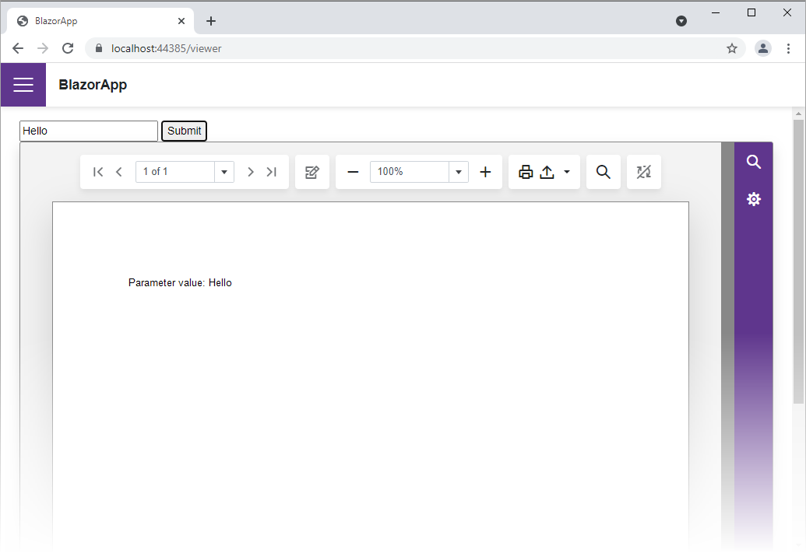

<!-- default badges list -->

<!-- default badges end -->
# Native Blazor Report  Viewer - Specify Parameter Values

This example demonstrates how to submit parameter values on button click.

## How to Run the Example

1. Download the project and update NuGet packages.
2. Build and run the project.
3. Navigate to a page that contains the document viewer.
4. Enter a parameter value in the editor and click the *Submit* button.

## Files to Review

* [Viewer.razor](CS/BlazorApp/Pages/Viewer.razor)

## Documentation

* [Report Viewer for Blazor Server (Native)](https://docs.devexpress.com/XtraReports/403594)
* [Specify Parameter Values in a Blazor Report Viewer (Native) Application](https://docs.devexpress.com/XtraReports/403272).
